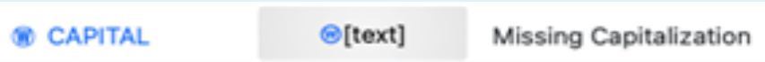
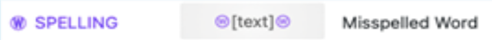
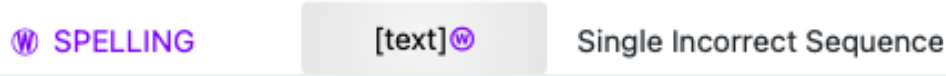
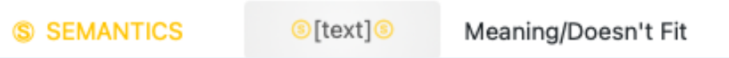
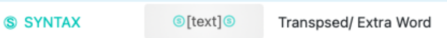
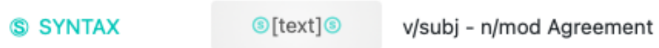

## CORRECT SEQUENCES
A sequence is defined as the connection from one written UNIT to the next (i.e., adjacent writing units). Adjacent writing units could be two words or it could be a word and a punctuation mark.  

Marking a correct writing sequence indicates that BOTH adjacent writing units correctly utilize spelling, punctuation, grammar, syntax, and capitalization per the rules of the writer’s dialect (more on this later). This manual uses a carat (^) to designate correct writing sequences. Carats have been added to the example sentences below to demonstrate the scoring of correct writing sequences. 
> **MAE1: ^I ^think ^the ^author ^cares ^about ^what ^his ^family ^thinks ^about ^him^. ^He ^wants ^to ^make ^his ^family ^happy^.**

> **AAE2: ^I ^think ^the ^author ^care ^about ^what ^his ^family ^thinks ^about ^him^. ^He ^wants ^to ^make ^his ^family ^happy^.** 

> **SoAE3: ^I ^think ^the ^author ^cares ^about ^what ^his ^family ^thinks ^about ^him^. ^He ^wants ^to ^make ^his ^family ^happy^.** 

## INCORRECT SEQUENCES
Every writing sequence (i.e., adjacent writing units) should receive a marking. The marking indicates if that sequence is correct or incorrect, according to the rules of the writer’s dialect (more on this in the next section). This manual uses Ⓦ to designate incorrect word-level sequences and Ⓢ to designate sentence-level sequences. Word-level errors include incorrect uses of capitalization and spelling. Sentence-level errors include incorrect uses of punctuation, semantics, and syntax, per the writer’s dialect. The specific rules for each of these areas are detailed below.  

|Symbol | Description |
| ----------- | ----------- |
|  |Mark before the word for (1) a proper name, (2) the beginning of a sentence, (3) the word “I”    |
|      | General misspellings. Misspellings also include incorrect homophone, combining two words, and incorrect apostrophe usage/lack thereof.  |
|      | Use this button when there is already another type of error marked at the beginning of the word.  |
|       | Missing or misused punctuation (mark the sequence before the punctuation). Commas are counted as missing only when (1) introducing a direct quote, (2) in a series (Oxford not required), (3) after an introductory phrase/clause (not transition words).  |
|       |Use when the word is spelled correctly and is the correct figure of speech, but does not convey the correct meaning in the context of the sentence |
|       |Use when a word is missing  |
|          |Use when words are transposed or there is an extra, unneeded word |
|    |Use this to mark verbs that do not agree with their subject and to mark nouns that do not agree with their modifiers |  
## CONSIDERATIONS FOR DIALECT
Language is ever-evolving, adapting to the needs of its speakers over time. Even people who speak the same language will speak (and write) in a variation that is often shared by the people culturally similar to and/or geographically close to each other, in other words, a dialect (Wolfram & Schilling-Estes, 2016).  

Given that “to speak a language is to speak some dialect of that language” (Wolfram & Schilling-Estes, 2016, p. 2), that each of these dialects is rule-governed (Rickford, 1999; Wolfram et al., 1999), and that purpose of writing is to express oneself and to communicate with others, we align our work with the Committee on College Composition and Communication’s (CCCC) resolution that all “students have a right to their own patterns and varieties of language -- the dialects of their nurture or whatever dialects in which they find their own identity and style” (CCCC, 1974, p. 2).  

Since we also “view variety of dialects as an advantage” (CCCC, 1974, p. 8), we have purposefully chosen not to penalize students’ use of dialect in their writing as errors when that use does not correspond to “typical” or edited, mainstream American English (hereafter referred to as mainstream American English; MAE). 
## WORD-LEVEL ACCURACY
Accuracy at the word-level measures errors that involve incorrect uses of capitalization and spelling, accounting for dialect variations that may affect spelling. See the examples below and Appendix A for more explanation.  

Word-level errors are marked by this symbol, Ⓦ, a blue encircled capital W. 
##### CAPITALIZATION
Mark an incorrect sequence BEFORE a word that should be capitalized but is not.  
* A correct sequence can be marked after the word if it is spelled correctly and the next adjacent unit is also correct.  
> **Thinks ^about ^him^. Ⓦhe ^wants ^to ^make** 
* Capitalization is required in only these instances: 
1. the beginning of a sentence or a quotation,  
1. a proper name,  
1. the word “I”. Please note that the capitalization error is marked before the word I and not after the word I.  
1. If there is a title, the student should capitalize the first word of the title.  
**Note**: There are many other capitalization rules. However, errors associated with those capitalization rules are less likely to influence the quality of a written work and will not be counted as errors for the purposes of this assessment. 
##### SPELLING
An incorrect sequence is marked on both sides of a word that is spelled incorrectly, taking into consideration the student’s dialect. Typically, the following conditions are considering spelling errors (though coders should always consider dialectical context first): 
* The word is spelled incorrectly for the context of the sentence.  
> **^Mom ^and ^the ^boy ^will ^ride ⓌthereⓌ bikes^.** 
* The student combines two words into one.  
> **^It ^also ^will ^take ⓌalotⓌ of ^cleaning^.** 
* The student splits one word into two separate words. 
> **^at ^the ^park ^on ^the ^sideⓌwalk^.**   
> **^It ^was ^a ⓌdissⓌgrace ^when ^she**   

Differences in students’ dialects may impact their spelling. The following would be acceptable spelling variations that are due to common, rule-governed dialect features: 
* Consonant cluster reductions  
> **^He ^ran ^so ^fas ^no ^one ^could ^catch ^him^.**  
> **^I ^like ^that ^dog ^since ^she ^is ^frienly^.** 
* Voiced and unvoiced th variations 
> **^Jump ^rope ^is ^a ^way ^to ^stay ^healfy^.**  
> **^Dis ^is ^my ^bike^.**  
* Use of “ain’t” in place of have + not, are + not, or do + not 
> **^They ^ain’t ^coming^.**   
> **^She ^ain’t ^eat ^meat^.** 
* Use of “finna” /“fitna,” “sposeta,” or “bouta” as contractions for “fixing to,” “supposed to,” or “about to” 
> **^We ^finna ^leave ^soon^.**   
> **^They ^sposeta ^be ^in ^class^.**   

There are a few other spelling guidelines to keep in mind: 
* Assume all proper names are spelled correctly. 
* Correct abbreviations are acceptable. 
* Due to the timed nature of this task, do not mark an incorrect or correct sequence after the final sequence. The student may not have had time to complete a word or to add punctuation at the end of a sentence. 
> **^Susan ^hopes ^they ^will co** 
## SENTENCE-LEVEL ACCURACY
Accuracy at the sentence-level measures errors that involve incorrect uses of punctuation, syntax, and semantics, accounting for dialect variations (especially in the area of syntax). See the examples below and Appendix A for more explanation.  

Sentence-level errors are marked by this symbol, Ⓢ, a blue encircled capital S. 
##### PUNCTUATION
The end of a sentence should be scored with a mark between the last word and the punctuation AND between the punctuation and the beginning of the next sentence. Correct punctuation receives two correct marks (one on either side of the punctuation mark). Therefore, missing punctuation requires two incorrect marks. In order for both marks to be correct, there needs to be a correctly spelled word, followed by correct punctuation, followed by a capital letter beginning the first word of the next sentence.  
> **^At ^the ^gas ^station ^, ^Tony ^told ^Sam ^to ^give ^the ^money^to ^the ^gas ^station ^owner^. Ⓦit ^took ^a ^15 ^second ^wait^ just ^ to ^give ^the ^money^. ^After ^ thatⓈⓈ the ^owner ^gave ^back ^the ^changeⓈⓈTony ^was ^waiting^ outside ^for ^Sam ^to ^come ^back ^out ^to ^pump ⓈupⓈ the ^gas^.**

The following rules apply for commas:  
* Missing commas should have two incorrect marks for clear instances of a need for a comma or other punctuation. Commas are ONLY required in 3 situations 
1. Introducing a direct quotation
2. In a series  
    a. The CCSS has not specifically stated whether Oxford commas are necessary, so both of the following examples are correct uses of commas in a series: 
    > **^It ^will ^make ^people ^sick^, ^cough^ or^ itch^.**   
    > **^It ^will ^make ^people ^sick^, ^cough^,^ or^ itch^.** 
3. After an indtroductory phrase of clause
* The comma rule does NOT apply to transition words: 
> **^Also ^we^ can ^ride**  
* If commas or any other extraneous mark of punctuation are inserted incorrectly, mark incorrect writing sequences around the comma: 
> **^The ^article ^tells ^you ^what ^plants ^are ^good ^to ^have ^in ^FloridaⓈ, Ⓢand ^what^ plants ^are ^bad ^to ^have ^in ^Florida^.**  
* When numbers are used, mark correct sequences when commas are used correctly or not used at all. Only mark incorrect sequences if the commas are misused. 
> **^Maldives ^has ^a ^population ^of ^340000^.**   
> **^Maldives ^has ^a ^population ^of Ⓢ3400,00Ⓢ.**  

There are multiple other punctuation rules and guidelines to keep in mind: 
* Place correct or incorrect marks between all adjacent punctuation. For example, use two incorrect marks when a comma is missing prior to quotations (one incorrect mark for the sequence from the word to the comma and one incorrect mark from the comma to the quotation mark).  
> **^The^ second^ quote ⓈⓈ "^Opportunity ^is ^missed ^by ^most ^people ^because ^it ^is ^dressed ^in ^overalls ^and ^looks^ like ^work^"^ is^ explaining ^that**
* If the comma is incorrectly placed in relation to the quotation marks, mark the comma as incorrect. 
> **^ “^I ^wrote ^the ^story^”Ⓢ, Ⓢshe ^said^.**
* If quotation marks, colons, semicolons, ellipses, parentheses, or dashes are used correctly, mark correct sequences on both sides of the punctuation. Only mark incorrect sequences if these punctuation marks are clearly misused or if their absence creates a sentence fragment.  
> **^just ^three ^natural ^ingredients Ⓢ ; Ⓢmycelium ^(^the ^vegetative ^part ^of ^mushrooms^)^, ^hemp^, ^and ^salt^.**
* Apostrophes are marked with an incorrect sequence on both sides of the word. This applies when an apostrophe is missing or when an apostrophe is incorrectly added.  
> **^so ^you ⓈwontⓈ get ^a ⓌcaviteyⓌ.**   
> **I Ⓢwen'tⓈ back ^to ^the ^waterpark^.** 
* Hyphens – ignore them. If a missing hyphen creates a word that can’t stand alone, score it as incorrectly split.  
> **^A ^seven-^year-^old ^boy ^joined ^the ^Navy^.**   
> **^A ^seven ^year-^old ^boy ^joined ^the ^Navy^.**   
> **^A ^7-^year-^old ^boy ^joined ^the^ Navy^.**  
> **^Using ^the ^post-test ^data**   
> **^despite ^the ^almost ^non Ⓢlivable ^conditions^.**  
* Incorrect spacing around punctuation is ok and correct sequences should be used. In other words, spacing does not affect scoring 
* For any errors where the incorrect punctuation is used, use the ‘missing punctuation’ button. 
* For run-on sentences determine where a logical break should be located and mark TWO incorrect sequences in that location.  
* Some will have multiple run-ons. After identifying the first run on, the next determination of a run-on should be based on assuming the previous mistake was corrected. 
> **^This ^story^ is ^about ^a ^girl Xname ⓌarielleⓈⓈ that ^she ^was ^going ^fishing ^with ^her ^dad ^and ^her ^brother Ⓦjeoy ^and Ⓦarielle ^did ^not ^want ^to ^go ^fishing ⓈⓈshe ^was ^going ^to ^the ^mall ^but ^her ^mom ⓌcoughtⓌ a ^cold ⓈⓈ now ^she ^has ^to ^go ⓌfichingⓌ.^Then ^she ^got ^her ^stuff** 

    > **^I ^would ^try ^to ^stay ^healthy ^by ^eating ^two ^cups ^of ^fruit ^each ^day ⓈⓈ and ^I ^would ^try ^to ⓌlimiteⓌ my ^eating ^of ^sugar ^because ^I ^have ^to ^stay ^healthy ^to ^keep ^in ^sports ⓈⓈ and ^I ^would ^try ^to ^eat ^five ^to ^six ^ounces ^of ^meat ^and ^try ^not ^to ^stay ^inside** 
##### SYNTAX
Mark two incorrect sequences when a word is missing, words are transposed, or there is an extra word or phrase.  
> **^Dogs ^are ⓈtheⓈ one ^of ^the^ mostⓈⓈ mamalⓌ that**  
> **^They ^would ^have ^to ^evacuate ^quickly ^before ^the ^lava ^could ^hit ^them Ⓢcould ^hit ^themⓈ or ^damage ^their ^cars^.**    

Mark incorrect sequences around verbs that do not agree with subject and nouns that do not agree with modifiers.  
> **^The ^author ⓈlikeⓈthe ^cell ^phone ^because ^you ^can ^use ^it ^for ^many ⓈthingⓈ.** 
Differences in students’ dialects may impact their syntax. The following would be acceptable syntactical variations that are due to common, rule-governed dialect features: 
* Absence of verb forms “is,” “are” (Zero Be) 
    > **^They ^hungry^.** 
    > **^He ^funny^.**
*  Absence of -s as regular third person present tense marker 
    > **^He ^eat ^everyday ^at ^home^.** 
    > **^She ^talk ^a ^lot^.** 
* Absence of -ed as regular past tense marker, or use of present tense in place of irregular past tense marker 
    > **^She ^cook ^my ^breakfast^.** 
    > **^And ^then ^they ^drink ^it ^all^.**
* Subject-verb agreement with “be” or “don’t”
    > Place holder for later examples 
* Absence of modal auxiliary “do”
    > **^You ^have ^a ^dog^?**
    > place holder for later example 

##### SEMANTICS
* Mark incorrect sequences around a word that may be correctly spelled and the appropriate part of speech, but does not fit the meaning of the sentence. 
    > **the^ person ^who ^was ^the ⓈheadlineⓈ of ^the ^job ^did ^not ^like ^peopleX thatX were** 

## FREQUENTLY ASKED QUESTIONS
* When a student talks like they speak, these words should be marked as correct.  
    * Examples are inserting the word “like” or using slang, such as “kinda” 
* A sequence should be marked before the very first word of a paragraph.  
    * Example at the beginning:      
    > **^The ^increase ^in ^tourism…**
    * Example in the middle:   
    > **…after ^attracting ^them ^over^.**   
    > **^A ^spider ^that ^is ^alike…**
* If the student uses a title  
    > **^Ants ^and ^Their ^Amazing ^Talents**   
    > **^In ^Poland ^there ^are ^many ^ants…**
* You will likely never have more than 2 incorrect sequences next to each other. If there is ever a case to be made for 3 in a row, bring it up to the group for discussion.  
* How do you score the last word the student wrote? Never mark a sequence (correct or incorrect) after the last thing that the student wrote. If the student was in the middle of typing a word, ignore that last word. If they completed the word or have punctuation marked, score the sequence before the word/punctuation, but not after.  
    > **^I ^would ^eat ^all ^of ^the ^healthy ^things ^that ^could ^keep^ me he**   
    > **^Broiled ^meat ^or ^grilled ^can ^give ^you n**   
    > **^I ^would ^eat ^all ^of ^the ^healthy ^things^.** 
* Agreement - mark incorrect sequences for subject verb disagreement and incongruencies with number for adjective  
    > **^There XisX a ^lot ^of ^different ^ways**   
    > **^We ^had ^3 XcarX.**  

 If you find subject/verb disagreement that is separated by more than 2-3 words, make a note in the notes section for it to be reviewed. 
 * Numerals are ok and marked as correct as long as they are used correctly. 
 * Case - In the following example, the word should be myself rather than me. However, we are not marking incorrect sequences for problems with case. 
    > **^Laws ^help ^me ^and ^other ^people ^keep ^safe^.**
* Symbols and abbreviations - if the symbol or abbreviation is used correctly it should be marked as correct.  
    > **^&^** 
    > **^T.V.^   or  ^TV^** 
    > **^I ^like ^dogs ^etc^.**
* If punctuation is missing, mark the missing punctuation, but do NOT also penalize for missing capital letter.   
    > **^stay ^healthy ^to ^keep ^in ^sports ⓈⓈ and ^he ^would ^try ^to ^eat ^five ^to ^six ^ounces ^of ^meat**
* If the student including ‘planning’ notes in their essay; score it like connected words. 
    > **^(^introduction^) @consequences ^of ^increased ^tourism ^at ^national ^parks^.**   
    > **^(^paragraphP@ increased ^tourism ^has^ caused ^a ^lot ^of ^chaos^.**
## LIMITATIONS
A writing sequence only considers the correctness between adjacent written units; it does not always reflect grammatical issues at the paragraph level and sometimes misses grammatical issues at the sentence level. For example, it will not reflect shifts in verb tense or voice from sentence to sentence. At the sentence level, it is also sometimes very difficult to determine where a long run-on sentence should end, or if there are multiple places to mark insertion of end punctuation. Furthermore, it does not capture errors regarding parallel construction at the sentence or paragraph level.  

At first, scoring of CIWS is time-consuming due to the many rules. After some practice with the scoring, the average time to score CIWS is less than 5 minutes. There may be some situations that do not fit the rules listed above, and it may be difficult to determine whether correct or incorrect sequences should be marked. Since writing has an infinite number of possible responses, difficult-to-score situations are highly likely. In these situations 

1 – Score the writing using your best judgment  

2 – Copy the sentence or the entire writing sample in the FAQs document on Dropbox. 

3 – Include the student ID number & prompt name  
## ADDITIONAL EXAMPLES
Several practice examples are provided here. A Florida student wrote each example below in response to the writing prompts in the open response diagnostic assessment of the FAIR-FS. The scoring is demonstrated below each example, based on the dialect of the writer. The calculation of CIWS for each individual example is also provided.  

Student Speaks: MAE 

I rember like it was yesterday  it was me, my sister , my other sister and my mom. My sisters and I and my mom were walking to the water ride and I looked at a sigh and I didn't see my family  then the first thing I did was I wen't back to the waterpark  and I asked if thay had seen a tail wuman and two kid. Thay said that thay were at the waterslide  I ran up to my mom . And that is the time I was lost.

^I ⓌremberⓌ like ^it ^was ^yesterdayⓈⓈ it ^was ^me^,^my ^sister ^,^my ^other ^sister ^and ^my ^mom^.^My ^sisters ^and ^I ^and ^my ^mom ^were ^walking ^ to ^the ^water ^ride ^and ^I ^looked ^at ^a ⓌsighⓌ and ^I ^didn't ^see ^my ^family ⓈⓈ then ^the ^first ^thing ^I ^did ^was ^I  Ⓢwen'tⓈ back ^to ^the ^waterpark ^and ^I ^asked ^if  ⓌthayⓌ had ^seen ^a ⓌtailⓌ wumanⓌ and ^two ⓈkidⓈ. ⓌThayⓌ said ^that ⓌthayⓌ were ^at ^the ^waterslideⓈⓈ I ^ran ^up ^to ^my ^mom^.^And ^that ^is ^the ^time ^I ^was ^lost^. 

                               76 (CWS) 

                              -23 (IWS) 

    CWS = 76    IWS = 23    CIWS = 53 

Student Speaks: AAE 
dogs are the one of the most  mamal that can get you loving, laughing, and smiling. Once they get to know you well in there min theyre be saying  " hey this family is kinda cool ". 

 
Ⓦdogs ^are ⓈtheⓈ one ^of ^the^ most ⓈⓈ mamalⓌ that ^can ^get ^you ^loving^, ^laughing^, ^and ^smiling^. ^Once ^they ^get ^to ^know ^you ^well ^in Xthere XminX theyreX be ^sayingⓈⓈ "Ⓦhey ^this ^family ^is ^kinda ^cool^"Ⓢ.  

                               30 (CWS) 

                              - 14 (IWS) 

    CWS = 30    IWS = 14   CIWS = 16

I think the author cares about what his family thinks about him . he wants to make his family happy by contiuing the traidition, but has his own dream of doing something else with his life.  he dosent want to be like everyone else in his family that went down the path and 

^I^ think^ the^ author^ cares^ about^ what^ his^ family^ thinks^ about^ him^.X he^ wants^ to^ make ^his ^family^ happy ^by XcontiuingX theX traiditionX, ^but ^has^ his ^own^ dream^ of^ doing ^something^ else ^with ^his^ life^. X he XdosentX want^ to^ be ^like^ everyone^ else^ in^ his ^family ^that ^went^ down ^the^ path ^and 

                               47 (CWS) 

                              - 8 (IWS) 

    CWS = 47    IWS = 8    CIWS =  39 

She  could get more monny from pet sitting and it  keep her buzzy and she can use the monny to get what ever  she wants when she wants, like food, drink, cloths, and other  things. You never know that a cat or dog or kid would run out of the house like in the story. 

^She ^could^ get ^moreX monnyX from ^pet^ sitting^ and^ it XXkeep^ her XbuzzyX and ^she^ can ^use ^the Xmonny Xto^ get ^what Xever ^she^ wants ^when ^she ^wants ^,^like^ food^, ^drink ^,Xcloths X,^and ^other^ things^. ^You ^never XknowX that^ a^ cat^ or^ dog^ or^ kid^ would^ run^out^ of the ^house^ like^ in^ the^story^.  

                               48 (CWS) 

                              -13 (IWS) 

    CWS = 48    IWS = 13   CIWS =  35 

Well  e and her family ever since she was a little girl she and her family would always go out to a restraunt and they would get caught up on the news and talk about there weekends. she had said that she usaully gets the pancakes . but this time her dad said  why don't you  try something new like the french toast. and she said okay  and when the surver brought it out. when she went and took a bute  she said she liked it. So for now on she gets pancakes one time and the french toast the ne t  when her and her family get together. but now that she is older and goes to college  she doesn't do it ever sunday. 

^Well X e Xand ^her ^family Xever ^since ^she ^was^ a ^little ^girl ^she ^and ^her ^family ^would ^always ^go^out ^to ^a XrestrauntX and ^they ^would ^get ^caught ^up ^on ^the^ news ^and ^talk ^abouX XthereX weekends^. Xshe ^had ^said ^that ^she XusaullyX gets ^the ^pancakes^. Xbut ^this ^time ^her ^dad ^saidXX why^^don't ^you ^ try ^something ^new ^like ^the ^french ^toast^. Xand ^she ^said ^okayX and Xwhen ^the XsurverX brought^ it^ out^. Xwhen ^she ^went ^and ^took ^a Xbute Xshe ^said ^she^ liked ^it^. ^So XforX now ^on ^she ^gets ^pancakes ^one ^time ^and ^the ^french ^toast ^the ^nextX when^ her ^and ^her ^family ^get ^together^. Xbut ^now ^that ^she ^is ^older ^and ^goes ^to ^college XXshe ^doesn't ^do ^it XeverX sunday^. 

                               103 (CWS) 

                              - 32 (IWS) 

    CWS = 103    IWS = 32   CIWS =  71 

The relationship between lamar and his father  is  a person who tell his dad anything that deals with work or something private. Even though his father have good  intention, but sometimes he will get a little to rough about the situation. Lamar father was a person is like if you cant  ace the test you will not be able to drive. 

^The^ relationship ^between Xlamar ^and^ his^ father ^ is XXa^ person^ who Xtell Xhis^ dad^ anything ^that^ deals ^with ^work ^or^something^private^. ^Even^ though ^his^ fatherX haveX good ^intention^, Xbut Xsometimes^ he ^will ^get^ a^ little Xto Xrough^ about^ the ^situation^. XLamar Xfather was^ a XpersonX is ^like ^if^ you Xcant X ace^the^ test ^you ^will ^not^ be ^able ^to ^drive^. 

                               48 (CWS) 

                              -17 (IWS) 

    CWS = 48    IWS = 17   CIWS =  31 

<<<<<<< HEAD
## TIDE
=======
## TIDE
>>>>>>> 8183a41076e719564975ce208ad944d7cea9d204
